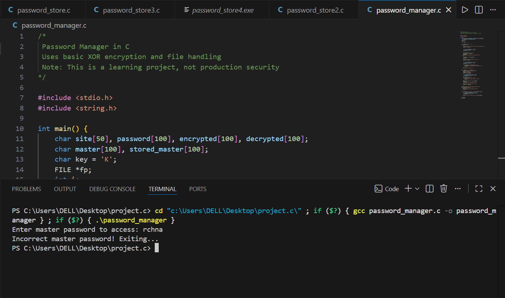
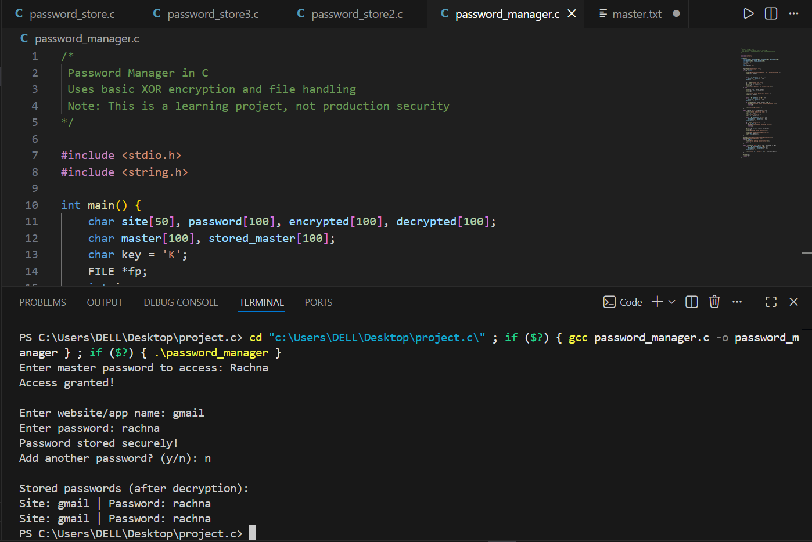
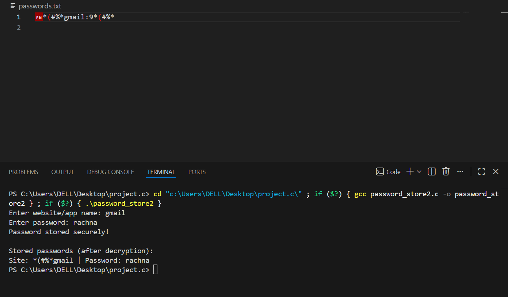

# Password Manager in C

## Overview
This project is a simple command-line based password manager written in C.  
It stores passwords in an encrypted format using basic XOR encryption and file handling.  

⚠️ This project is created for learning purposes and is **not intended for production-level security use**.

---

## Features

- **Master Password Protection:** Access to stored passwords is secured with a master password. Users are prompted to set one if it does not exist.  
- **Basic XOR Encryption:** Passwords and the master password are encrypted using a simple XOR-based method before storage.  
- **Password Storage:** Securely stores passwords for multiple websites or applications in a `passwords.txt` file.  
- **Add Multiple Passwords:** Users can add multiple passwords in a single session with a simple prompt.  
- **Password Retrieval:** Stored passwords are automatically decrypted and displayed in a readable format when accessed with the correct master password.  
- **Simple Command-Line Interface:** Easy-to-use text-based interface suitable for learning and practicing file handling and encryption in C.  
- **Basic Error Handling:** Alerts the user if necessary files cannot be opened or accessed.  

---

## Technologies Used

- C Programming  
- File Handling  
- Basic Encryption (XOR)  

---

## How It Works

1. User sets a master password (stored in encrypted form).  
2. On login, the master password is verified.  
3. User can add passwords for different websites/apps.  
4. Passwords are stored in encrypted format in a file.  
5. Stored passwords are decrypted and displayed after authentication.  

---

## Screenshots

### Set Master Password


### Login


### Password File Storage



## How to Compile and Run

```bash
gcc password_manager.c -o password_manager
./password_manager
```

---

## Limitations

- Uses basic XOR encryption (not secure for real-world use)  
- No GUI (command-line only)  
- Passwords stored locally  

---

## Future Improvements

- Stronger encryption algorithms  
- Password update and delete functionality  
- GUI-based version  
- Migration to Python  

---

## Contributing

Contributions are welcome! If you want to help improve this project, you can:

- Fork the repository  
- Create a new branch for your feature or bug fix  
- Submit a pull request with your changes  
- Report issues or suggest improvements via GitHub Issues  

Please ensure your code follows the existing style and is well-documented.

---

## License

This project is licensed under the MIT License. See the [LICENSE](LICENSE) file for details.


